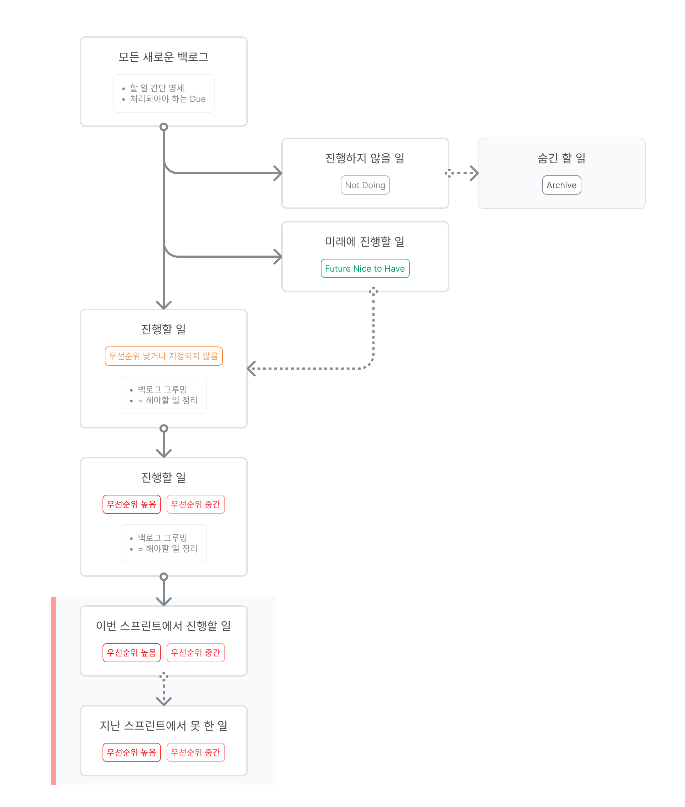

 🔗 이 글은 Amy Ly님이 <a href='https://blurbsbyamy.medium.com/' target='blank' rel='nofollow' id='outlink1' onclick='clickedOutlink(outlink1)'>미디엄</a>에 올린 <a href='https://medium.com/agileinsider/building-a-backlog-your-team-will-love-ba159c1b6ad7' target='blank' rel='nofollow' id='outlink2' onclick='clickedOutlink(outlink2)'>아티클</a>을 번역, 요약한 글입니다.

스타트업 씬에서 빠르게 프로덕트를 개발하다보면 백로그에 남아있는 이슈들이 점점 많아지게 되는 경험을 많이 해보셨을 것 같아요. 백로그에 등록된 이슈들은 우선순위를 관리해주지 않으면 이슈가 쌓이기만 하고, 스프린트로 올라와서 해결되는 이슈는 점점 적어지고, 그 크기나 중요도와 관계 없이 아이디어들만 중구난방으로 흩어져있는 창고가 되기 쉽습니다.

저도 B2B SaaS 프로덕트를 만들 때는 고객의 요구사항에 의해 짧은 기간에 해결해야 할 로드맵이 구성되기 쉽고, UX 개선이나 내부적으로 의미있는 기능들은 뒷단으로 밀리는것을 경험하고 있습니다. 백로그를 아이디어의 무덤이 되지 않게 활용할 수 있도록 소개하는 방법을 시도해보세요!

1. 들어오는 업무를 기록하기 쉽게 하기  
- 새로 들어오는 업무 요청사항들은 여러 이해 관계자로부터 발생할 수 있습니다. 백로그는 앞으로 해야 할 업무가 쌓이기 시작하는 Source of Truth로 활용될 수 있어야 합니다. 이 Source of Truth에 쌓인 업무들으로 우선순위를 파악하는 작업이 이어집니다.
    > 📝 기록되어야 할 것: 모든 새로운 할 일

2. 그루밍이 필요한 할 일이 무엇인지 알기 쉽게 하기  
- 백로그에 등록된 이슈들 모두가 업무할 수 있도록 정리될 필요는 없습니다. 한 백로그에서 장기, 중기, 단기 할일들이 쌓이게 될 것입니다. 백로그 그루밍을 시간 효율적으로 하려면 단기 할일들을 우선해서 그루밍 할 수 있도록 해야합니다.
    > 📝 기록되어야 할 것: 일이 처리되어야 하는 due
- 고객사 임팩트가 적거나, 실행 가능하지 않은 아이디어들에는 그루밍을 할 필요가 없습니다. 그런 이슈들은 Not Doing 로 태깅하고 다음 이슈로 넘어갈 수 있어야 합니다.
    > 📝 기록되어야 할 것: Status - Not Doing
- 장기적으로 미래 로드맵에서 가져가면 좋은 이슈들은 지금 내용을 정리할 필요는 없지만, 나중에 다시 와서 쉽게 확인할 수 있어야 합니다. 
    > 📝 기록되어야 할 것: Status - Future Nice to Have

3. 우선순위가 높은 할 일을 찾기 쉽도록 하기  
- 우선순위를 결정하는 것은 어려운 일입니다. 실행 하기로 결정되어 그루밍 된 이슈들 중 우선순위가 낮거나 아직 우선순위가 판단되지 않은 이슈와, 우선순위가 높은 이슈들을 구분해서 더 중요한 일을 쉽게 확인하도록 할 수 있습니다.
    > 📝 기록되어야 할 것: Status - 우선순위 낮거나 지정되지 않음  
    > 📝 기록되어야 할 것: Status - 우선순위 높음
- 다음 스프린트에 할 일 / 이전 스프린트에서 못 한 일  
  - 백로그에 처음 등록된 할 일은 최종적으로 '다음 스프린트에 할 일'으로 이동하게 됩니다. 그리고 이번 스프린트 할 일은 새로 등록된 할 일과 지난 스프린트에서 끝내지 못한 일을 하게 됩니다.
    > 📝 기록되어야 할 것: Status - 이번 스프린트에서 할 일  
    > 📝 기록되어야 할 것: Status - 지난 스프린트에서 못 한 일

4. 불필요한 일은 숨기기  
- 보통 진행하지 않기로 한 업무는 히스토리 관리를 위해 삭제하지는 않습니다. 진행하지 않기로 한 업무들을 Archive하여 보이지 않도록 정리할 필요가 있습니다.
    > 📝 기록되어야 할 것: Status - Archive

