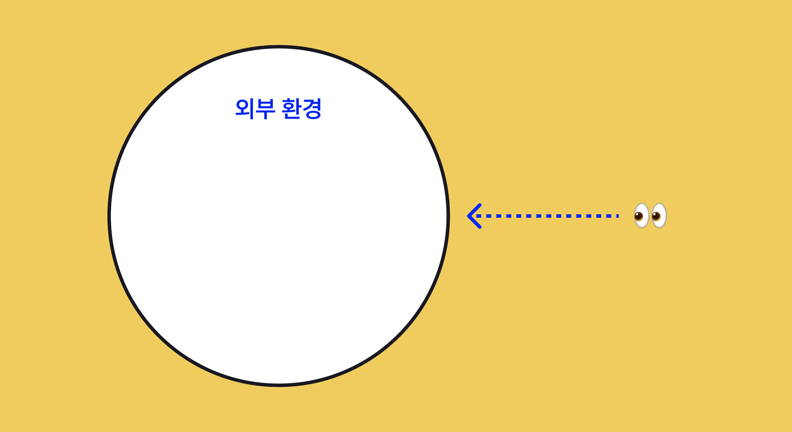

저는 <a href='https://airbridge.io/' target='blank' rel='nofollow' id='outlink1' onclick='clickedOutlink(outlink1)'>Airbridge</a>라는 B2B 프로덕트를 디자인하고 있습니다. 에어브릿지는  광고•마케팅 데이터를 매체와 서비스로부터 수집하여 분석한 데이터를 대시보드를 통해 제공하여 퍼포먼스 마케터의 업무를 돕는 역할을 합니다. 디자인하기 위해서는 사용자에게 깊은 이해가 필수적인데, 퍼포먼스 마케터의 실제 업무와 페인포인트를 공감하기 어려웠습니다. 프로덕트는 도메인 종사자가 아니면 이해하기도 어렵고, 디자인하기도 어렵고, 심지어는 사용자를 만나기도 어렵습니다.

아마 다른 B2B SaaS 솔루션을 디자인하는 프로덕트 디자이너들도 똑같은 고민을 하고 있을 거라고 생각합니다. 도데체 B2B 프로덕트는 왜 이렇게 디자인하기 어려울까요?

# B2B 프로덕트는 왜 존재할까? <!-- omit in toc -->

B2B 프로덕트를 디자인할 때 신경 써야 할 것을 알아보기 전에, B2B 프로덕트가 뭔지, 어떤 특징을 가지는지 먼저 알아볼 필요가 있습니다.

B2B 프로덕트는 **`기업 근로자의 업무를 더 잘 할 수 있도록 도와주기`** 위해 존재합니다. B2B 프로덕트는 **사용자의 업무상 발생하는 문제**를 해결해주기 위해 존재합니다. 친구들과 간 여행지에서 찍은 셀카를 자연스럽게 보정해준다든지, 전 세계 플레이어들과 경쟁해 높은 순위를 쟁취하는 등 개인적인 일상에서 재미를 주기 위한 것이 아닙니다. 이 특징은 B2B 프로덕트의 가장 기본적인 특징이며 이후 B2B 프로덕트이기 때문에 가지는 특징과 이를 디자인하기 위해 염두에 둬야 할 점들을 모두 관통한다고 할 수 있습니다.

<figcaption>업무중인 사용자가 즐거울리가 없습니다.. 원작: 우라사와 나오키 [플루토]</figcaption>

그렇다면 **'기업 근로자의 업무'**가 무엇이길래 우리가 해결해주려고 하는 걸까요? B2B 프로덕트가 해결하고자 하는 기업 근로자의 업무는 다음과 같이 나눠볼 수 있습니다.

**1. 난이도는 낮지만 귀찮은 작업**
> - 반복적인 작업이거나, 하는데 시간이 많이 드는 작업

**2. 작업 난이도가 어려운 작업**
> - 기업이 자체적으로 효율적인 워크플로우를 만들기 어렵거나 가성비가 나오지 않는 작업
> - 전문가가 별도로 필요한 업무
 
1번과 같은 경우엔 프로덕트는 해당 작업을 자동화하는 방식으로 문제를 해결합니다. 그리고 2번의 경우엔 프로덕트가 효율적인 시스템을 대신 구축 및 운영을 해주거나, 전문적인 영역을 시스템이 대체해주는 방식으로 문제를 해결합니다.

# 이후 이야기할 B2B 프로덕트의 구분 <!-- omit in toc -->

B2B 프로덕트는 수도 없이 많습니다. 평소 우리가 잘 알지 못하는것에 비해 여러 분야에 여러 방식으로 프로덕트가 존재합니다. 비슷한 프로덕트를 상상하며 읽으실 수 있도록 이후 이야기할 B2B 프로덕트의 특징이 이 모든 프로덕트를 다룰 순 없어서 임의로 프로덕트를 구분하여 진행하겠습니다.

**1. 주로 특정한 사용자군만 사용하는 프로덕트 // 여러 사용자군이 함께 사용하는 프로덕트**
   > - 개발자, 디자이너, 마케터, 인사담당자 등 특정 사용자군이 메인 사용자인 경우
   > - 특별히 사용자군을 구분하지 않고 사용되는 프로덕트

**2. 다른 프로덕트와 연계해서 사용하는 것이 중요한 프로덕트 // 프로덕트 그 자체로 독립적으로 사용되는 프로덕트**
   > - 프로덕트를 만들기 위해 시스템에 도입되거나 여러 시스템 간 연동작업을 통해 데이터를 주고받으며 가치를 생산해내는 프로덕트
   > - 다른 프로덕트나 시스템과 연계성이 없어도 프로덕트 그 자체의 가치가 떨어지지 않는 프로덕트

<figcaption>B2B 프로덕트의 구분 1</figcaption>

제가 디자인하고 있는 프로덕트는 주로 특정한 사용자군만 사용하는 프로덕트이며, 다른 프로덕트와 연계해서 사용하는것이 중요한 프로덕트입니다. 제가 디자인하는 에어브릿지는 퍼포먼스 마케터가 주로 사용하며, 여러 광고 매체와 고객사의 서비스와 연동하여 데이터를 수집하는 것이 프로덕트 가치에 아주 중요한 역할을 합니다.

이 구분에 포함되어있는 다른 프로덕트의 예시로는 커뮤니케이션 API 공급업자인 Twilio, 결제 시스템 제공업자인 Stripe, 웹사이트 방문자 분석 솔루션인 Google Analytics, 사용자 행동 분석 툴인 Amplitude, 개발자들을 위한 성지 Github 등이 있습니다.

<figcaption>B2B 프로덕트의 구분 2</figcaption>

앞으로 이어질 글을 읽으시며 위와 같은 프로덕트를 상상하시면서 읽으시면 이해에 더 도움이 되리라 생각합니다.

---

### 👀 빠르게 훑어보기 <!-- omit in toc -->

> - [1. 사용자 관점](#1-사용자-관점)
>   - [1-1. 사용자들은 프로덕트를 '즐기려고' 사용하는 것이 아니다](#1-1-사용자들은-프로덕트를-즐기려고-사용하는-것이-아니다)
>   - [1-2. 사용자들은 돈을 많이 지불하지만 그만큼 요구사항이 많고 보수적이다](#1-2-사용자들은-돈을-많이-지불하지만-그만큼-요구사항이-많고-보수적이다)
>   - [1-3. 사용자들의 문제점은 명확하지만 복잡하고, 발견하기는 어렵다](#1-3-사용자들의-문제점은-명확하지만-복잡하고-발견하기는-어렵다)
>   - [1-4. 핵심 사용자군 이외에 고려해야 할 사용자군이 많다 (Stakeholder가 많다)](#1-4-핵심-사용자군-이외에-고려해야-할-사용자군이-많다-stakeholder가-많다)
> - [2. 프로덕트 관점](#2-프로덕트-관점)
>   - [2-1. 프로덕트 개발 비용이 높다](#2-1-프로덕트-개발-비용이-높다)
>   - [2-2. 사용자의 프로덕트 도입 비용, 전환 비용이 높다](#2-2-사용자의-프로덕트-도입-비용-전환-비용이-높다)
>   - [2-3. 프로덕트 복잡도가 높다](#2-3-프로덕트-복잡도가-높다)
> - [3. 외부 환경 관점](#3-외부-환경-관점)
>   - [3-1. 여러 B2B 프로덕트, 산업과 연관 관계가 많다](#3-1-여러-b2b-프로덕트-산업과-연관-관계가-많다)
>   - [3-2. 프로덕트의 성숙이 곧 산업의 성장으로 이어지지 않는다](#3-2-프로덕트의-성숙이-곧-산업의-성장으로-이어지지-않는다)

# B2B 프로덕트의 특징 <!-- omit in toc -->

B2B 프로덕트의 특징을 다음 3 가지 관점으로 구분해 바라볼 수 있습니다.

<figcaption>B2B 프로덕트의 특징 3가지</figcaption>

## 1. 사용자 관점

### 1-1. 사용자들은 프로덕트를 '즐기려고' 사용하는 것이 아니다

B2B 프로덕트는 기업 근로자의 업무를 더 효율적으로 완료할 수 있도록 하는 것에 있습니다. 사용자는 B2B 프로덕트를 사용함으로써 현재 가지고 있는 인적 자원 리소스를 다른 곳에 사용할 수 있고, 자체적으로 문제를 해결하는 것보다 더 낮은 비용으로 높은 효용을 달성하는 것을 기대합니다.

사용자에게 B2B 프로덕트의 가치는

> 1. **귀찮은 작업을 직접 손대지 않고 자동적으로 처리해 줄 때**
> 2. **어려운 작업을 효율적으로 완료해줄 때**
> 3. **내가 알지 못하는 인사이트를 잘 제공했을 때**

위 세 가지 방법으로 제공되었을 때 비로소 실현될 수 있습니다.

### 1-2. 사용자들은 돈을 많이 지불하지만 그만큼 요구사항이 많고 보수적이다

B2B 프로덕트는 B2C 프로덕트와 달리 대중을 타겟으로 하지 않고 특정 도메인의 사용자들을 타겟하기 때문에 고객 수가 더 적습니다. 기업 고객은 현재 겪고 있는 문제를 해결해주기 때문에 일반 고객보다 지불 의향이 더 높고, 지불할 금액에 대한 허들도 일반 고객보다 덜한 편입니다. 이처럼 고객 수는 적고 수익은 높기 때문에 **B2B 프로덕트의 고객 당 Revenue는 B2C 프로덕트의 그것보다 더 높습니다**.

높은 비용으로 B2B 프로덕트 회사로부터 가치 제공에 대해 계약하였으므로 프로덕트 팀에게는 SLA(Serveice Level Agreement)를 지켜야 하는 의무가 생기고, 고객에게는 프로덕트 팀에게 기능을 요구할 수 있는 명분이 생기게 됩니다. 이는 **한 고객이 더 높은 금액을 지불할수록 더 많이 요구할 수 있는 명분이 생기는 일종의 힘의 시소**입니다. 또한 B2B 프로덕트를 구매하기 전 원하는 기능을 특정 일자에 도입하는 것을 전제로 계약하기를 원하는 고객들도 종종 있습니다.

저의 회사에서도 동일한 케이스가 있었습니다. 어떤 중요한 고객이 특정 기능을 20년 12월까지 개발하기를 원했었고, 프로덕트 팀은 그 일정을 만족시키기 위해 밤을 새우며 개발해야 했습니다.

### 1-3. 사용자들의 문제점은 명확하지만 복잡하고, 발견하기는 어렵다

B2C 프로덕트에 종사하는 사람 중 많은 사람이 이후 어떤 방향으로 나아가야 할 지 로드맵이 없고 미래가 불안하다는 것을 힘든 점으로 꼽는 사람이 많습니다. 하지만 B2B 프로덕트가 해결하고자 하는 기업 사용자의 워크플로우에서 발생하는 문제점은 명확합니다. 분명히 존재하고 있고 발견하기만 하면 되는 것이죠. 하지만 기업 사용자의 일이라는 것은 문제를 발견하기 쉬울 만큼 단순 작업의 반복이 아닙니다. **사용자는 업무 시간 동안 여러 사람과 상호작용 하고, 여러 시스템을 통해 다양한 정보를 수집하고, 하나의 일도 복잡한 과정을 거쳐야 하는 경우가 많습니다**.

일반적으로 사용자는 현재 워크플로우에 개인별로 최적화된 방법을 스스로 만들어 본인의 워크플로우에 적용해서 가진 리소스를 최대한 효율적으로 사용하고 있을 가능성이 높습니다. **사용자들이 기존 워크플로우에 너무 익숙해 있는 경우 오히려 문제를 문제라고 인식하고 있지 못하는 경우**도 발생해 사용자로부터 문제를 끌어내는 것이 더 어려운 경우도 있습니다.

<figcaption>디자이너와 사용자 간 거리</figcaption>

B2B 프로덕트는 B2C 프로덕트보다 디자이너와 사용자의 거리가 더 멉니다. B2B 프로덕트의 모객에는 세일즈 과정이 가장 핵심적인 역할을 하고, 실사용자와 프로덕트 구매를 결정하는 구매자가 다르기까지 합니다. 이처럼 프로덕트 디자이너가 사용자를 만나 관찰하고 이야기를 듣기 어려운 환경적인 특징이 있습니다.

### 1-4. 핵심 사용자군 이외에 고려해야 할 사용자군이 많다 (Stakeholder가 많다)

제가 이야기 하고는 프로덕트는 특정 사용자군이 메인으로 사용하는 프로덕트입니다. 하지만 이런 종류의 프로덕트더라도 B2B 프로덕트는 필수적으로 여러 종류의 사용자나 유관자가 존재할 수밖에 없는 구조입니다.

B2B 프로덕트를 실제로 사용하는 **사용자**, 해당 프로덕트를 구매하는 **구매자**, 비용 책정 방식과 지불 방식을 알아야 하는 **재무팀**, 사용자로부터 보고를 받을 **매니저**, 매니저의 보고를 받을 더 **상위 매니저**, 고객 서비스의 데이터를 관리하는 **데이터팀**, 데이터 보안을 신경쓰는 **보안팀**, 프로덕트 사용이 법률을 준수하는지 확인해야 할 **법률팀** 등 다양한 사용자군이 한 프로덕트를 사용하고, B2B 프로덕트는 이런 사용자들에게 적절한 정보를 전달해줄 방법을 구비해야 합니다.

## 2. 프로덕트 관점

<figcaption>B2B 프로덕트의 특징 3가지 - 프로덕트 관점</figcaption>

### 2-1. 프로덕트 개발 비용이 높다

한 기업이 워크플로우를 효율적으로 개선할 수 있는 시스템을 스스로 구축, 운영하는 것 보다 B2B 프로덕트를 구매하는 것이 더 비용 대비 효용이 클 때 B2B 프로덕트는 PMF를 발견했다고 할 수 있습니다. 반대로 말하면 **모든 PMF를 발견한 B2B 프로덕트는 한 기업을 위한 시스템이기엔 비용 효율적이지 않은, 비싼 결과물**이라고 할 수 있습니다. 대신 한 번 만들고 나서는 다수 사용자에게 배포하는데 추가 비용이 거의 들지 않는 소프트웨어 특성을 활용하여, 규모의 경제를 실현하는 방식으로 수익화를 합니다.

이처럼 시스템 자체가 비싼데도 불구하고 여러 방해물이 더 있습니다. 프로덕트는 다수의 고객사에게 **균질한 품질을 제공**할 수 있도록 운영되어야 하지만, **일부 대형 고객들의 커스텀한 기능 요구** 역시 들어줘야 합니다. 또 **B2B 프로덕트는 수명 주기가 B2C 프로덕트에 비해 길기 때문**에 오랜 기간에 걸쳐 개발되어온 프로덕트일수록 기존 기능과 이후 기능이 복잡하게 얽혀 **프로덕트 복잡도가 높아지게** 됩니다. 이 때문에 특정 기능을 추가, 삭제, 발췌하는 경우 생각지도 못한 부분에서 오류가 발생하는 등 개발 비용이 높아질 수 밖에 없습니다.

또 **'Most ideas fail'** 이라는 문장이 있을 만큼 기능이나 개선이 실패하는 경우도 많습니다. 안 그래도 기능 하나 추가하거나 개선 하나 하는데도 비용이 높은데 릴리즈한 기능이나 개선이 실패하는 경우 고객사에게 손해가 가기도 하고, 투입된 시간과 리소스들이 무용지물이 되어버릴 수도 있습니다.

### 2-2. 사용자의 프로덕트 도입 비용, 전환 비용이 높다

이미 다른 프로덕트를 사용하고 있는 상태에서 다른 프로덕트를 도입하기 위해 드는 비용을 전환 비용이라고 합니다. **B2B 프로덕트는 B2C 프로덕트보다 도입하는 데 드는 비용도, 전환하는 데 드는 비용도 높습니다**.

B2B 프로덕트를 도입하기 위해서는 걸맞은 인프라를 구축하고, 기존 쌓여있던 데이터를 프로덕트에 맞게 세팅하거나 전처리를 해야 하고, 프로덕트에 대한 사용법도 익혀야 합니다. 이미 다른 프로덕트를 사용하고 있는 경우, 이전 프로덕트에 맞게 세팅된 데이터를 도입하려 하는 프로덕트에 맞게 다시 세팅하고 데이터를 마이그레이션 해야 하며, 새로운 툴 사용법을 익혀야 합니다. 만약 프로덕트가 제공하는 결과물이 변경되는 경우 변경된 결과물에 대한 해석 방법과 활용 방법도 추가로 익혀야 합니다.

**이런 높은 도입 비용과 전환 비용은 프로덕트를 구매하고 사용하기까지 가장 큰 허들**로 작용하게 됩니다. 기존 프로덕트에 문제가 있다는 것을 알면서도 새로운 프로덕트를 도입하지 않고 계속 사용하는 행동은 사용자가 기존 워크플로우에 문제가 있다는 것을 알고 있음에도 불구하고 도입과 전환을 위한 작업을 위해 드는 비용이 크다고 생각하기 때문입니다. 또, **기존 프로덕트의 기능 추가나 UX 개선사항에도 높은 전환 비용의 개념이 적용**될 수 있습니다. 새로운 기능이나 개선된 UX를 제공하면 사용자는 익숙하게 사용하던 기존 워크플로우를 버리고 새로운 워크플로우를 익혀 도입해야 합니다. 이때 들어갈 비용이 더 높다고 생각하는 경우 사용자는 업데이트를 받지 않고 이전 버전을 그대로 사용하고자 하기도 합니다.

### 2-3. 프로덕트 복잡도가 높다

B2B 프로덕트는 사용자의 복잡한 워크플로우에서 발생하는 복잡한 문제를 해결해야 하므로 프로덕트의 복잡도는 높을 수 밖에 없습니다. B2B 프로덕트는 주로 많은 데이터를 처리하고, 여러 모듈이 상호작용하고, 각자의 목표를 가진 여러 사용자의 유즈 케이스를 대응해야 하는 등 **프로덕트의 복잡도를 늘릴 수 있는 여러 요소를 고려해 만들어야** 합니다.

또한, 프로덕트가 발전해감에 따라 전체 워크플로우에서 점점 더 많은 부분을 담당하는 방향으로 변화하게 됩니다. 이런 자연스러운 **발전 과정에서 프로덕트가 해결하고자 하는 문제가 많아지면서 프로덕트의 복잡성도 높아지게** 됩니다.

<figcaption>2002년 Jira 스크린샷. Jira는 설치형 이슈 트래커로 시작했지만 지금은 수많은 기능을 가진 프로젝트 관리 플랫폼이 되었다. 출처: <a href='https://community.atlassian.com/t5/Feedback-Forum-articles/Happy-Anniversary-to-the-Atlassian-Community/ba-p/762647' target='blank' rel='nofollow' id='outlink2' onclick='clickedOutlink(outlink2)'>아틀라시안 커뮤니티</a></figcaption>

## 3. 외부 환경 관점

<figcaption>B2B 프로덕트의 특징 3가지 - 외부 환경 관점</figcaption>

### 3-1. 여러 B2B 프로덕트, 산업과 연관 관계가 많다

앞서 언급했듯이 B2B 프로덕트 중 특정 사용자군이 중심으로 사용하고, 여러 프로덕트간 연계해서 사용하는 것이 중요한 프로덕트를 중심으로 서술하고 있습니다.

B2B 프로덕트가 사용자의 귀찮고 시간이 많이 걸리는 일을 신경 쓰지 않게 하기 위해서는 제공하는 프로덕트가 고객의 서비스나 다른 프로덕트와 **매끄럽게 연동되어 자동화된 시스템으로 작동해야** 합니다. 만약 프로덕트의 연동이 제대로 되지 않는 것이 확인된 순간, 사용자는 전체 퀄리티를 검증하기 위해 다른 요소들도 오류 없이 매끄럽게 연동이 되는지 테스트를 해야 하므로 워크플로우 상 발생하는 문제점을 사용자에게 그대로 다시 돌려주게 되는 셈입니다.

최근 애플이 주도하고 있는 개인정보 보호 이슈로 인해 광고 시장에서 이를 대응하기 위해 새로운 시스템을 빠르게 만들고 사용자들에게 현 상황에 적응하여 프로덕트를 사용하는 방법에 대해 교육하고 있습니다. 만약 본인의 프로덕트가 애플과 같이 산업을 리딩하고 있는 회사가 아니라면 프로덕트는 경쟁사나 관련된 외부 회사들의 움직임, 법률 환경의 변화, 사회적 인식의 변화 등에 따라 **기존 이슈들보다 더 우선적으로 대응해야 하는 이슈들이 생겨나게** 됩니다.

### 3-2. 프로덕트의 성숙이 곧 산업의 성장으로 이어지지 않는다

B2C 프로덕트는 잘 만든 하나의 애플리케이션이 새로운 시장을 만들기도 하고, 더 많은 사용자가 몰리게 되어 산업 자체가 커지는 일이 왕왕 발생하곤 합니다. 이전 세상에서는 문자와 전화가 커뮤니케이션의 핵심이었지만 카카오톡 메신저가 등장한 이후 한국에서 카톡 없이 디지털 커뮤니케이션을 논하기가 어렵게 되었고, 카카오라는 회사가 여러 새로운 산업을 주도하게 되었습니다.

하지만 Adobe가 아무리 디자인 툴을 파워풀하고 잘 만든다고 해서 세상이 디자이너를 더 많이 요구한다거나, 디자이너의 공급이 계속해서 늘어나기는 어렵습니다. 아무리 Stripe가 결제 시스템을 도입하기 간편하게 만든다고 해서 결제가 필요 없던 시스템에까지 Stripe를 쓰게 하기는 어렵습니다. 이처럼 **B2B 프로덕트에서는 프로덕트가 성장한다고 해서 산업 자체가 성장하게 하지는 못한다는 한계점**이 있습니다.

B2B 프로덕트는 워크플로우 상 발생하는 문제를 해결해줍니다. 동일한 도메인이라도 모든 기업 사용자가 워크플로우에서 똑같은 문제점을 느끼고 있기는 어렵습니다. 이런 특징 때문에 보통 B2B 프로덕트는 워크플로우를 한 프로덕트만 사용해도 모든 문제가 해결될 수 있는 'All-in-one 솔루션'이 아닌, **각 문제를 해결하는 여러 프로덕트를 만드는 방식으로 포트폴리오를 확장**하게 됩니다. 이런 방식은 B2B 프로덕트의 전환 비용이 높기 때문에 동일한 시스템을 공유하는 하나의 프로덕트 그룹을 사용했을 때 다른 프로덕트로 전환하기 힘들다는 특성을 활용한 비즈니스 전략이기도 합니다.

SAP, Google은 All-in-one 솔루션을 제창하지만, 상세 도메인 별 솔루션을 운영하는 방식으로 프로덕트 포트폴리오를 가지고 있습니다. SAP 프로덕트는 200개, Google Cloud Platform 프로덕트는 100개가 넘는 프로덕트를 가지고 있습니다.

---

여기까지 B2B 프로덕트가 가지는 특징을 알아보았습니다. 모든 프로덕트에 공통적으로 적용되는 이야기가 아닐 수도 있지만, B2B 프로덕트를 만들고 있는 분들이라면 한 번쯤은 공감해보셨을 내용일 것입니다. 다음 글에서는 이런 B2B 프로덕트의 특징을 바탕으로 프로덕트 디자이너가 신경 써야 하는 점들은 무엇인지, 어떤 노력이 필요한지를 알아보겠습니다.

---

### B2B 디자이너들의 모임 소개  <!-- omit in toc -->

B2B 프로덕트를 만들고있는 B2B 디자이너들은 B2C 디자이너보다 더 어려운 문제를 풀고 있는 경우가많은데 비해 자료, 지식, 피드백을 찾는데도 어려움을 겪고 있습니다.

더 많은 B2B 프로덕트 디자이너들이 한 자리에서 어려운 점, 배운 점을 공유하고 서로 도움이 되기 위해 커뮤니티를 운영중입니다.

[🔗 B2B 디자이너들의 모임 노션 바로가기](https://abit.ly/b2b-designers)

---

### References <!-- omit in toc -->

> - <a href='https://uxdesign.cc/designing-for-b2b-enterprise-saas-eda3e43cee7b' target='blank' rel='nofollow' id='outlink3' onclick='clickedOutlink(outlink3)'>Designing for B2B and Enterprise SaaS</a>  
- <a href='https://jefago.medium.com/how-b2b-and-b2c-product-management-differ-7be351578532' target='blank' rel='nofollow' id='outlink4' onclick='clickedOutlink(outlink4)'>How B2B and B2C Product Management Differ</a>  
- <a href='https://platum.kr/archives/114731' target='blank' rel='nofollow' id='outlink5' onclick='clickedOutlink(outlink5)'>스타트업과 함께 성장한 디자이너 이야기</a>  
- <a href='https://story.pxd.co.kr/832' target='blank' rel='nofollow' id='outlink6' onclick='clickedOutlink(outlink6)'>B2B스타트업에서의 Lean UX</a>  
- <a href='https://brunch.co.kr/@hayangkil/4' target='blank' rel='nofollow' id='outlink7' onclick='clickedOutlink(outlink7)'>B2B에서 UX 디자인이란?</a>  
- <a href='https://brunch.co.kr/@uxgongbang/15' target='blank' rel='nofollow' id='outlink8' onclick='clickedOutlink(outlink8)'>시작부터 다른 B2B UX</a>  
- <a href='https://cxdojo.com/whats-the-difference-b2b-and-b2c-product-management' target='blank' rel='nofollow' id='outlink9' onclick='clickedOutlink(outlink9)'>WHAT’S THE DIFFERENCE: B2B AND B2C DIGITAL PRODUCT MANAGEMENT</a>  
- <a href='https://blog.relate.kr/how-to-sell-b2b-product/' target='blank' rel='nofollow' id='outlink10' onclick='clickedOutlink(outlink10)'>B2B 제품을 파는 법</a>
- <a href='https://www.chrischae.kr/switching-costs/' target='blank' rel='nofollow' id='outlink11' onclick='clickedOutlink(outlink11)'>7 Powers | 전환비용(Switching Costs)</a>