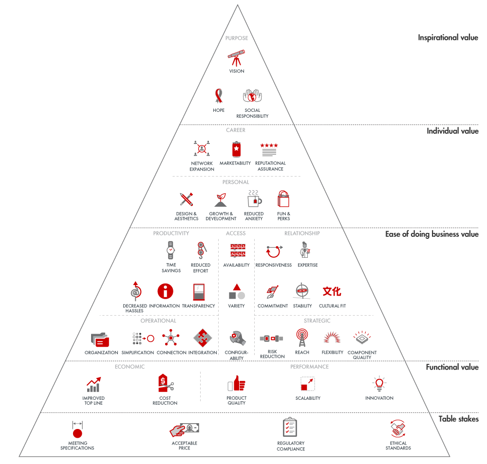
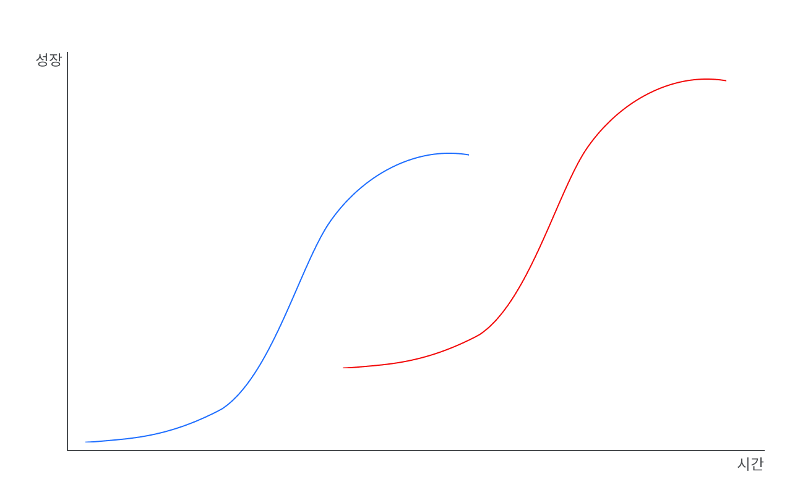

이전 글(<a href='https://tjrichard.github.io/blog/8-things-keep-in-mind-as-b2b-product-designer/' target='blank' rel='nofollow' id='outlink1' onclick='clickedOutlink(outlink1)'>B2B 프로덕트 디자이너가 신경써야 할 8가지 #1 - B2B 프로덕트의 특징</a>)과 이어집니다.

이전 글에서는 B2B 프로덕트가 가지는 특징을 알아보았습니다. 이번 글에서는 B2B 프로덕트의 특징을 고려해 B2B 프로덕트 디자이너가 어떤 점을 더 신경 써야 하는지 그 요소와 마인드 셋에 대해 알아보겠습니다.

### 👀 빠르게 훑어보기 <!-- omit in toc -->

> - [1. 사용자를 명확히 알아야 한다](#1-사용자를-명확히-알아야-한다)
>   - [(1) 더 나은 사용자 리서치를 할 수 있도록 환경을 준비해야 한다](#1-더-나은-사용자-리서치를-할-수-있도록-환경을-준비해야-한다)
>   - [(2) 내가 제공할 가치가 사용자에게 정말로 필요한 것인지 확신할 수 있어야 한다](#2-내가-제공할-가치가-사용자에게-정말로-필요한-것인지-확신할-수-있어야-한다)
>   - [(3) 여러 Stakeholder(사용자군)를 고려해야 한다](#3-여러-stakeholder사용자군를-고려해야-한다)
> - [2. 사용자의 ‘문제'를 해결하는 데 집중해야 한다](#2-사용자의-문제를-해결하는-데-집중해야-한다)
>   - [(4) UX/UI는 명확하고, 예측 가능하며, 문제 해결에 실용적이어야 한다](#4-uxui는-명확하고-예측-가능하며-문제-해결에-실용적이어야-한다)
>   - [(5) UX/UI 개선은 사용자들이 쉽게 받아들일 수 있도록 해야 한다](#5-uxui-개선은-사용자들이-쉽게-받아들일-수-있도록-해야-한다)
>   - [(6) 기능 릴리즈가 UX 개선보다 언제나 중요하다](#6-기능-릴리즈가-ux-개선보다-언제나-중요하다)
> - [3. 프로덕트가 처해있는 환경을 고려해야 한다](#3-프로덕트가-처해있는-환경을-고려해야-한다)
>   - [(7) 경쟁 관계 등 외부 환경 요인에 따라 현재 집중해야 하는 분야가 달라질 수 있다](#7-경쟁-관계-등-외부-환경-요인에-따라-현재-집중해야-하는-분야가-달라질-수-있다)
>   - [(8) 프로덕트의 성장 단계를 고려해야 한다](#8-프로덕트의-성장-단계를-고려해야-한다)
>   - [프로덕트의 진정한 성장을 위해서는…](#프로덕트의-진정한-성장을-위해서는)

# 디자이너가 신경 써야 하는 점 <!-- omit in toc -->

## 1. 사용자를 명확히 알아야 한다

### (1) 더 나은 사용자 리서치를 할 수 있도록 환경을 준비해야 한다

<figcaption>디자이너와 사용자 간 거리</figcaption>

**사용자를 만나기 힘들다**

B2B 프로덕트는 B2C 프로덕트보다 디자이너와 사용자 간 거리가 더 멉니다. 긴 거리로 인해 사용자를 만나고 피드백을 수집하기 물리적으로 더 어려운 환경에 처해있습니다. B2B 프로덕트의 실사용자는 기업 사용자이므로 기업 내부 이야기를 바깥에서 하고 싶지 않은 경우도 많습니다.

**사용자의 이야기를 듣기 힘들다**

사용자와 거리가 멀고 사용자와 직접적인 인터랙션을 할 채널이 마땅치 않아 B2B 프로덕트 사용자의 피드백을 수집하기는 어렵습니다. 또, 사용자는 현재 워크플로우에 익숙해져 있어 문제를 문제로 느끼지 못할 가능성도 높습니다.

이런 이유 때문에 일반적인 경우 세일즈 팀, CSM 팀이 고객의 워크플로우와 고객이 말하는 문제점을 물어다 주는 방식으로 기능 로드맵을 꾸려나갑니다. 하지만 이런 방법은 사용자가 말하지 않는 것은 발견할 수 없다는 점과, 사용자의 말도 다른 사람이 한 차례 옮긴 결과라 컨텍스트가 걸러질 수밖에 없다는 한계점이 있습니다. 

**👉 따라서 B2B 프로덕트를 디자인 할때는 좀 더 나은 사용자 리서치를 할 수 있는 방법을 환경적으로 마련해야 합니다. 가능한 방법의 예시로는 다음이 있습니다.**

> 1. 세일즈팀, CSM 팀이 프로덕트 팀과 고객이 커뮤니케이션 할 수 있는 채널이 되어준다
> 2. 세일즈팀, CSM 팀이 직접 고객의 입장에서 리서치 대상이 되어준다
> 3. 도메인 전문가를 컨설턴트로 고용한다
> 4. 사용자에게 직접 접근이 가능한 조직과 파트너십을 맺는다

### (2) 내가 제공할 가치가 사용자에게 정말로 필요한 것인지 확신할 수 있어야 한다

**사용자의 문제를 발견하기 어렵다**

프로덕트 디자인을 하기 위해서는 고객이 겪고 있는 문제를 명확하게 알아야 하는것이 필수입니다. 하지만 B2B 프로덕트는 1. 내가 실사용자도 아니며, 2. 사용자의 워크플로우는 복잡하고 어려우며, 3. 사용자를 쉽게 만나기도 어렵습니다.

**👉 사용자의 문제를 발견하고 공감하는데 B2C 프로덕트보다 더 의식적인 노력이 필요합니다.**

**기능을 개발하고 제공하는 비용이 크다**

비싼 비용으로 기능을 개발했는데 고객이 이를 도입하는 것도 비싼 비용이 드는 행위입니다. 만약 내가 사용자의 문제를 제대로 해결해주지 않는 기능을 제공했다면 프로덕트 내로는 개발 비용을 낭비한 것이 되며, 사용자에게는 비즈니스에 타격을 줄 수도 있습니다.

문제는 신중하게 기능을 선보인다고 해도 실패하는 경우는 발생할 수밖에 없다는 것입니다. 개발 과정 중 가장 비용이 저렴한 파트는 디자이너가 더 깊이 생각하고 끊임없이 질문을 던지며 날카롭게 다듬어가는 과정입니다.

**👉 디자이너는 제공할 기능과 개선사항이 사용자의 문제를 진정으로, 효율적으로 해결해준다는 확신을 가질 수 있어야 합니다.**

우리 회사는 디자이너가 지금 생각하는 솔루션이 사용자의 문제를 해결해주는 것이 맞는지 확인하기 위해 '<strong>더 많이 생각한 사람이 이긴다</strong>'라는 카피아래 서로의 생각에 계속해서 챌린지하는 문화를 가지고 있습니다.

### (3) 여러 Stakeholder(사용자군)를 고려해야 한다

B2B 프로덕트는 여러 사용자군이 사용하는 프로덕트 입니다. B2B 프로덕트는 실사용자 외에 존재하는 여러 Stakeholder를 고려한 디자인이 필수입니다. 이전 글에서 들었던 다른 사용자군의 예시를 다시 들어보겠습니다.

- 사용자: 겪고 있는 문제를 효율적으로 해결하는 프로덕트, 직관적인 UX 제공
- 구매자(혹은 매니저): 프로덕트가 제공하는 효용을 한 눈에 알 수 있는 정보 페이지 제공
- 데이터팀: 프로덕트 도입을 위한 쉬운 온보딩, 마이그레이션 가이드 제공
- 보안팀: 정보 보안이 보장될 수 있음을 잘 표현하거나, 컨트롤 할 수 있는 페이지 제공
- 법률팀: 법률에 위반되지 않도록 데이터 활용하고, 안내 제공
- 재무팀: 어떤 방식으로 비용이 산정되는지, 현재까지 얼마나 사용했으며 비용이 어떻게 청구될 지 안내 제공

## 2. 사용자의 ‘문제'를 해결하는 데 집중해야 한다

### (4) UX/UI는 명확하고, 예측 가능하며, 문제 해결에 실용적이어야 한다

**B2B 프로덕트는 사용자의 문제 해결을 위해 존재한다**

사용자는 자신의 워크플로우를 효율적으로 완료하기 위해 B2B 프로덕트를 사용합니다. 프로덕트는 사용자의 과업을 얼마나 효율적으로(efficiency), 잘(effectiveness) 해결하는 데 도움을 주는지에 집중해야 합니다.

> 이를 위해서는 프로덕트 내외를 모두 잘 이해할 필요가 있습니다. 프로덕트가 어떻게 만들어지는지 그 과정과 한계를 잘 이해해야 하고, 사용자를 잘 이해하는 것이 도움이 됩니다.

사용자가 보는 즉시 직관적으로 알아볼 수 있는 화면을 제공해야 합니다. 이를 위해서는 표준화되고, 예측 가능하며, 실용적이고, 숨은 정보 없는 명확한 UX/UI를 만들어야 합니다. 또, 레거시 시스템과 자연스럽게 어우러져 기존 사용자, 신규 사용자, 가끔 사용하는 사용자 모두가 쉽게 익히고 사용할 수 있도록 해야 합니다.

**👉 '이전에 없던' 화려한 UX/UI로 사용자의 시선을 끄는 것은 금해야 할 첫 번째 죄악**

만약 오류가 예상되거나 사용자가 중요한 변경을 하는 플로우에서는 UX를 의도적으로 제약하거나, 다시 한번 사용자의 의도를 확인하는 절차를 거치도록 하고, 액션 이후 이전 상태로 되돌아갈 수 있도록 해야 합니다.

사용자의 주의집중, 학습, 사고, 문제 해결, 의사결정과 같은 사용자의 인지적 프로세스를 잘 지원해줘야 합니다.

**👉 사용자에게 통제감을 제공하고, 오류를 방지해야 합니다**

하지만 표준화된 UX를 제공하고, 오류를 방지하기 위해 번거로운 플로우를 제공해야 한다는 것이 곧 B2B 프로덕트에 쾌적한 UX와 미려한 UI가 필요 없다는 말이 아닙니다. 최근에는 B2B 프로덕트에 좋은 UX/UI가 사용자의 만족도와 매출에 큰 차이를 준다는 조사들도 많이 나오고 있습니다. 프로덕트의 구매자는 구매 전 여러 옵션을 고려할 텐데, 만약 프로덕트가 눈에 띄고 좋은 UX로 기억에 남을 수 있다면 우리 프로덕트를 선택하게 될 가능성도 높아질 것입니다. 사용자에게도 매력적인 UX, UI가 제공된다면 프로덕트를 익히고, 계속 사용하는데 더 동기부여가 될 수 있습니다.

B2B 프로덕트 사용자들은 업무 시간 외에는 일반 서비스를 사용하는 사용자이므로 일반 서비스의 쾌적한 UX와 심미적인 UI에 익숙한 그들은 B2B 프로덕트에도 어느 정도 기대치를 역시 가지고 있습니다.

**👉 B2B 프로덕트에도 쾌적하고 심미적인 UX/UI가 필요합니다**

### (5) UX/UI 개선은 사용자들이 쉽게 받아들일 수 있도록 해야 한다

**사용자들에게 새로운 UX/UI를 제공하게 되면 그들은 기존 워크플로우를 버리고, 새로운 방법을 다시 몸에 익혀야 한다**

이를 위해서는 내가 제공 할 개선이 다음 두 경우 중 하나여야 합니다.

1. **👉 개선된 내용이 기존 방식을 버리고 새로 익히는 단점보다 훨씬 훌륭해야 한다**
2. **👉 개선된 내용을 알아볼 정도지만 기존 방식에서 크게 달라지지 않고도 쉽게 도입해 사용할 수 있다**

내가 제공할 개선사항이 위 두 가지 중 하나가 아니라면 사용성이나 UI가 좋아지더라도, 사용자의 문제를 더 효율적으로 개선할 수 있다 하더라도 실제 사용자에게 받아들여지지 못하게 될 것입니다.

### (6) 기능 릴리즈가 UX 개선보다 언제나 중요하다

**프로덕트가 해결해야 할 복잡한 워크플로우의 문제점은 너무나도 많다**

사용자는 워크플로우에서 발생하는 복잡한 문제를 효율적으로, 잘 해결하기 위해 프로덕트를 사용합니다. 이 때문에 프로덕트의 경쟁력은 곧 사용자에게 필요한 기능을 제대로 구현하는 것입니다.

'기능 릴리즈'는 '해결해야 하는 문제를 80점으로 해결하기'라고 볼 수 있습니다.  
반면 '기존 프로덕트의 UX 개선'은 '이미 80점 맞은 문제를 90점으로 끌어올리는 것'이라고 볼 수 있습니다.  
우리가 만들고 있는 복잡한 프로덕트에는 해결해야 하는 문제가 정말 많습니다.

구매자의 입장에서도 프로덕트가 제공하는 가치에 돈을 지불하는 것이기 때문에 그들을 설득하기 위해서는 '저희 프로덕트가 쓰기 더 편해요' 보다는 '저희 프로덕트는 이런 문제를 해결해줘요'라는 설득이 필요합니다.

**👉 이미 80점을 달성한 문제를 90점까지 끌어올리려는 노력 이전에, 더 많은 문제를 80점으로 해결하는 노력을 해야 하는 것은 당연합니다.**

<figcaption>B2B 프로덕트가 기본적으로 갖춰야 할 가치 요소는 '기능'과 비즈니스를 잘(effectiveness), 효율적으로(efficiency) 해결해줄 수 있도록 도와주는 것'입니다 출처: <a href='https://www.bain.com/insights/eov-b2b-infographic/' target='blank' rel='nofollow' id='outlink2' onclick='clickedOutlink(outlink2)'>B2B Elements of Value</a></figcaption>

## 3. 프로덕트가 처해있는 환경을 고려해야 한다

### (7) 경쟁 관계 등 외부 환경 요인에 따라 현재 집중해야 하는 분야가 달라질 수 있다

**외부 환경에 따라 우선순위가 변경될 수 있음을 알아야 한다**

이것은 B2C 프로덕트일 때도 동일한 기본적인 요소이지만, 한 번 더 주지하자면 법률이 변하거나 산업을 주도하는 기업이 산업의 큰 방향을 뒤트는 경우 여기에 대응하기 위한 작업을 가장 높은 우선순위로 처리해야 합니다. 사용자의 비즈니스상 임팩트가 클 수 있는 변화일수록 더 높은 중요도로 처리해야 합니다. 내 프로덕트가 대응이 늦는다면 사용자는 비즈니스에 부정적인 임팩트를 피하기 위해 Churn 할 방법을 몰래 찾을지도 모릅니다.

만약 내 프로덕트가 다른 프로덕트나 여러 시스템과 연동이 중요한 프로덕트인 경우, 연동이 오류 없이 매끄럽게 되는 것이 사용자의 워크플로우 문제 해결에 직접적인 영향을 주는 경우가 많습니다. 이런 프로덕트의 경우 연동을 매끄럽게 되도록 하는 것이 결국 사용자의 문제를 80점으로 해결하기 위한 기본 전제가 됩니다.

내 프로덕트가 경쟁 프로덕트와 마켓 쉐어를 경쟁하고 있는 경우, 내 타겟 고객중 이미 내가 확보한 고객을 제외하면 경쟁 프로덕트가 확보한 고객이 가장 수익성 높은 고객일 가능성이 높습니다. 내 프로덕트의 수익성을 증가시키고 시장에서 영향력을 확보하는 목표가 경쟁 프로덕트 사용자를 가져오기 위한 전략을 사용하곤 합니다. 프로덕트 경쟁에서 이기기 위해서는 다음과 같은 가치를 가져야 합니다.

1. 기본적으로 사용자의 기능 요구사항들을 만족해야 함 (80점, 탈락하지 않을 이유)
2. 경쟁자보다 확연히 더 나은 장점을 가져야 함 (90점, 선택받을 이유)
3. 전환 비용을 낮출 수 있는 방법을 제공해야 함 (98점, 망설이지 않을 이유)

### (8) 프로덕트의 성장 단계를 고려해야 한다

<figcaption>프로덕트 라이프 사이클. 현재 프로덕트의 성장 단계에 따라 비즈니스 목표가 달라진다.</figcaption>

**연구 개발기**  
**초기 프로덕트는 고객에게 셀링이 될 수 있는 MVP를 만들어 고객을 검증하는 단계가 가장 중요하다**

> 초기 MVP라도 "viable" 하지 않으면 소용이 없습니다. 완성된 모습이 아닌 초기 단계에서도 스스로 생존할 수 있는 모델이어야 합니다.

초기 단계에서는 프로덕트의 PMF를 맞추기 위해 사용자의 문제를 파악하고, 린하게 프로토타입을 만들어 테스트해 고객을 개발하는 과정이 가장 중요합니다. 프로덕트 전체를 돌릴 시스템을 만드는 것보다 고객을 개발하는 것이 먼저입니다. 이 시기에 프로덕트의 PMF를 확인하기 위한 다양한 전략을 수행합니다. 실제 프로덕트 개발 전 프로덕트의 설명과 구매를 위한 폼이 있는 랜딩페이지를 만들어 사용자의 반응을 보는 'Fake door' 전략, 실제 시스템이 있는 것처럼 말하지만 사람이 백 단에서 직접 작업하는 '컨시어지 MVP'[^1] 등이 있습니다.

**👉 B2B 프로덕트 디자이너는 80점짜리 MVP를 빠르게 만들어서 고객을 개발하는 것에 집중해야 합니다.**

**도입기**  
**프로덕트의 시장성을 확보하는 단계가 가장 중요하다**

성장하기 시작한 프로덕트는 더 많은 신규 사용자들을 확보하거나, 더 수익성이 높은 고객을 확보하여 프로덕트의 시장성을 확보하는 데 집중하기 시작합니다. 이때는 Product-led Growth[^2] 방식이나 Sales-led Growth 방식이냐에 따라 크게 두 방향으로 전략이 나뉠 수 있습니다. Product-led Growth 방식을 추구하는 경우 프로덕트 팀은 프로덕트의 핵심 기능을 더 탄탄히 다지는 작업과 잠재 고객이 스스로 프로덕트를 찾아 도입하고 학습할 수 있는 환경을 만드는 작업이 필요합니다. Sales-led Growth 방식을 추구하는 경우 세일즈, 마케팅 활동에 큰 힘을 쏟기 때문에 프로덕트의 핵심 기능을 탄탄히 다지는 작업 이외에 세일즈와 마케팅 활동을 지원하거나 세일즈와 마케팅 활동에 도움이 되는 기능들을 개발하는 작업을 하게 됩니다.

**👉 B2B 프로덕트 디자이너는 새로운 사용자 수를 늘릴 수 있도록 사용자의 핵심 문제 발견과 해결에 집중하고 세일즈, 마케팅 활동을 지원합니다.**

**성장기**  
**성장기 단계의 프로덕트는 프로덕트와 비즈니스의 빠른 성장이 가장 중요하다**

이 단계에서는 프로덕트팀과 비즈니스팀 모두 사업을 빠르게 스케일업하고 수익성을 확보할 수 있는 방법을 찾아 시도하게 됩니다. 또한 프로덕트팀은 여러 방향으로 확장하며 복잡성이 증가하게 된 프로덕트가 방향을 잃지 않도록 유의해야 합니다.

**👉 B2B 프로덕트 디자이너는 비즈니스 수익성을 강하를 위해 신규 개발한 기능을 사용자가 잘 받아들이는지 실험하고 개선합니다.**

**성숙기**  
**기존 사용자를 유지하고 사용자당 수익을 높여야 한다**

성숙기 단계에서 프로덕트는 이미 안정적인 수익성을 가지고 있으며 시장에서도 큰 마켓 쉐어를 가지고 있게 됩니다. 이때 프로덕트는 신규 사용자를 유치하는 것보다는 기존 사용자를 Churn 하지 않도록 붙잡는 것이 더 비용 대비 효율적인 상황이 됩니다. 기존 사용자들의 리텐션을 높여 사용자가 계속 유료 사용자로 남아있도록 하고, 사용자당 수익을 높일 수 있는 방법을 시도합니다.

**👉 B2B 프로덕트 디자이너는 지표를 많이 확인하게 됩니다. 프로덕트 사용 Flow에서 이탈을 막고 Frictionless한 경험을 만들기 위해 부분 최적화를 달성하도록 노력합니다.**

**쇠퇴기**  
**새로운 모멘텀을 찾아 퀀텀 점프를 해야 한다**

B2B 프로덕트가 성숙한 만큼 시장이 성장하지 않습니다. 기존 시장은 언번들링(Unbundling)[^3]한 새로운 프로덕트에 잠식되기도 합니다. 이 단계에서는 더 큰 스케일업을 위한 퀀텀 점프가 필요한 단계입니다. 보통 해결하고자 한 워크플로우의 문제와 인접해있는 문제를 해결하는 프로덕트를 새로 개발해 제품 포트폴리오를 늘리는 방식을 취하곤 합니다. 하지만 이런 방식은 퀀텀 점프가 아닌, 다른 시장에서 새롭게 시작하는 방식입니다.

**👉 B2B 프로덕트 디자이너는 새로운 가치를 만들어낼 수 있는 방법을 고민해야 합니다. 하지만 시장에서 성공을 확신할 수 있는 방법은 미지의 영역일 것입니다.**

### 프로덕트의 진정한 성장을 위해서는…

**성숙기와 쇠퇴기에서 프로덕트가 정체되고 시장이 성장하지 않는 한계를 진정으로 해결하기 위해서는 프로덕트 라이프 사이클이 S 커브를 그려야 한다**

<figcaption>프로덕트 라이프 사이클의 S 커브</figcaption>

프로덕트가 성장하면 할수록 성장기를 기점으로 일반적인 프로덕트 성장을 위해 들인 노력에 비해 얻을 수 있는 성장의 곡선은 점차 낮아지게 됩니다.

- 프로덕트의 선형 혹은 지수 성장을 위해서는 사용자가 원하는 기능을 개발하고 사용자가 겪고 있는 문제를 잘, 효율적으로 해결해주어야 합니다.
- 하지만 프로덕트의 퀀텀 점프 성장을 위해서는 사용자의 워크플로우를 근본적으로 혁신할 수 있는 방법을 찾아야 합니다.

**👉 B2B 프로덕트 디자이너는 사용자가 원하는 기능을 개발하고, 사용자의 문제를 발견하고 해결해주어야 합니다**  
**👉 이와 더불어 평소 일 중간중간 내 프로덕트와 경쟁 프로덕트가 아예 존재하지 않는다고 가정하고 처음으로 돌아가 고객의 문제를 다시 보고, 이를 근본적으로 혁신할 수 있는 방법을 찾는 노력을 해야 합니다.**

---

### B2B 디자이너들의 모임 소개  <!-- omit in toc -->

B2B 프로덕트를 만들고있는 B2B 디자이너들은 B2C 디자이너보다 더 어려운 문제를 풀고 있는 경우가많은데 비해 자료, 지식, 피드백을 찾는데도 어려움을 겪고 있습니다.

더 많은 B2B 프로덕트 디자이너들이 한 자리에서 어려운 점, 배운 점을 공유하고 서로 도움이 되기 위해 커뮤니티를 운영중입니다.

[🔗 B2B 디자이너들의 모임 노션 바로가기](https://abit.ly/b2b-designers)

---

### References <!-- omit in toc -->

> - <a href='https://lab80.tumblr.com/post/68825159531/day-12-lean-ux-for-startups' target='blank' rel='nofollow' id='outlink3' onclick='clickedOutlink(outlink3)'>Day 12 - Lean UX for Startups</a>  
- <a href='https://jiyu0719.medium.com/what-i-learned-%ED%94%84%EB%A1%9C%EB%8D%95%ED%8A%B8-%EB%94%94%EC%9E%90%EC%9D%B4%EB%84%88%EC%9D%98-1%EB%85%84-%ED%9A%8C%EA%B3%A0-f978aff50ec' target='blank' rel='nofollow' id='outlink4' onclick='clickedOutlink(outlink4)'>What I learned — 프로덕트 디자이너의 1년 회고</a>  
- <a href='https://blog.naver.com/dpmayj/222178797449' target='blank' rel='nofollow' id='outlink5' onclick='clickedOutlink(outlink5)'>실리콘밸리에서 PM(Product Manager)으로 일한다는 것</a>  
- <a href='https://brunch.co.kr/@parkisthinking/42' target='blank' rel='nofollow' id='outlink6' onclick='clickedOutlink(outlink6)'>B2C vs B2B, 디자인 과정의 차이</a>  
- <a href='https://sonujung.com/product-design-in-startup' target='blank' rel='nofollow' id='outlink7' onclick='clickedOutlink(outlink7)'>프로덕트 디자인 in 스타트업</a>  
- <a href='https://www.gartner.com/en/sales/insights/b2b-buying-journey' target='blank' rel='nofollow' id='outlink8' onclick='clickedOutlink(outlink8)'>New B2B Buying Journey & its Implication for Sales</a>  
- <a href='https://www.lennysnewsletter.com/p/how-todays-fastest-growing-b2b-businesses' target='blank' rel='nofollow' id='outlink9' onclick='clickedOutlink(outlink9)'>How today's fastest growing B2B businesses found their first ten customers</a>  

[^1]: **컨시어지 MVP**: 초기 리멤버는 사용자들이 사진을 찍어 업로드 한 명함을 수기로 데이터베이스화 하는 컨시어지 MVP로 PMF를 확인했음
[^2]: **Product-led Growth**: 사용자가 스스로 프로덕트를 발견하고 가치에 공감하여 사용하게 하는 프로덕트 중심 Go-To-Market 전략. 주로 SMB(Small Medium Business)에게 제품을 판매하는 롱테일 전략을 사용함. 참조: <a href='https://productmanagerhq.com/product-led-growth/' target='blank' rel='nofollow' id='outlink10' onclick='clickedOutlink(outlink10)'>What is Product-Led Growth?</a>
[^3]: **언번들링**: 기존 묶여있던것을 풀어 개별적인 프로덕트로 만들어 출시하거나 요금을 부과하는 것. 참조: <a href='https://report.roa.ai/article/154374' target='blank' rel='nofollow' id='outlink11' onclick='clickedOutlink(outlink11)'>로아 리포트</a>