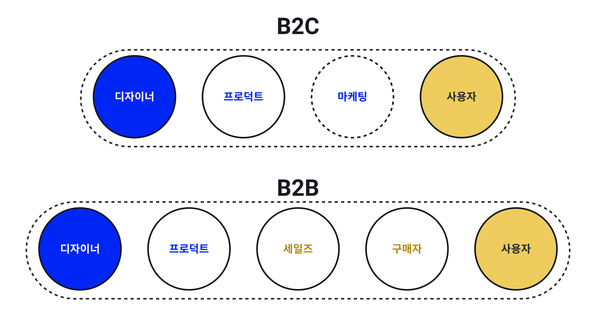

이 글은 이전 글(<a href='https://tjrichard.github.io/blog/8-things-keep-in-mind-as-b2b-product-designer/' target='blank' rel='nofollow' id='outlink1' onclick='clickedOutlink(outlink1)'>B2B 프로덕트 디자이너가 신경써야 할 8가지 #1 - B2B 프로덕트의 특징</a>)과 이어집니다.

이전 글에서는 B2B 프로덕트가 가지는 특징을 알아보았습니다. 이번 글에서는 B2B 프로덕트의 특징을 고려해 B2B 프로덕트 디자이너가 어떤 점을 더 신경써야 하는지 그 요소와 마인드셋에 대해 알아보겠습니다.

### 👀 빠르게 훑어보기 <!-- omit in toc -->

- [1. 사용자를 명확히 알아야 한다](#1-사용자를-명확히-알아야-한다)
  - [1-1. 더 나은 사용자 리서치를 할 수 있도록 환경을 준비해야 한다](#1-1-더-나은-사용자-리서치를-할-수-있도록-환경을-준비해야-한다)
  - [1-2. 내가 제공할 가치가 사용자에게 정말로 필요한 것인지 확신할 수 있어야 한다](#1-2-내가-제공할-가치가-사용자에게-정말로-필요한-것인지-확신할-수-있어야-한다)
  - [1-3. 여러 Stakeholder(사용자군)를 고려해야 한다](#1-3-여러-stakeholder사용자군를-고려해야-한다)
- [2. 사용자의 ‘문제'를 해결하는데 집중해야 한다](#2-사용자의-문제를-해결하는데-집중해야-한다)
  - [2-1. UX/UI는 명확하고, 예측 가능하며, 문제 해결에 실용적이어야 한다](#2-1-uxui는-명확하고-예측-가능하며-문제-해결에-실용적이어야-한다)
  - [2-2. UX/UI 개선은 사용자들이 쉽게 받아들일 수 있도록 해야한다](#2-2-uxui-개선은-사용자들이-쉽게-받아들일-수-있도록-해야한다)

# 디자이너가 신경 써야 하는 점 <!-- omit in toc -->

## 1. 사용자를 명확히 알아야 한다

### 1-1. 더 나은 사용자 리서치를 할 수 있도록 환경을 준비해야 한다

<figcaption>디자이너와 사용자 간 거리</figcaption>

**사용자를 만나기 힘들다**

B2B 프로덕트는 B2C 프로덕트보다 디자이너와 사용자 간 거리가 더 멉니다. 긴 거리로 인해 사용자를 만나고 피드백을 수집하기 물리적으로 더 어려운 환경에 처해있습니다. B2B 프로덕트의 실 사용자는 기업 사용자이므로 기업 내부 이야기를 바깥에서 하고싶지 않고싶어하는 경우도 많습니다.

**사용자의 이야기를 듣기 힘들다**

사용자와 거리가 멀고 사용자와 직접적인 인터랙션을 할 채널이 마땅치 않아 B2B 프로덕트의 사용자의 피드백을 수집하기는 어렵습니다. 또, 사용자는 현재 워크플로우에 익숙해져 있어 문제를 문제로 느끼지 못할 가능성도 높습니다.

이런 이유 때문에 일반적인 경우 세일즈 팀, CSM 팀이 고객의 워크플로우와 고객이 말하는 문제점을 물어다주는 방식으로 기능 로드맵을 꾸려나갑니다. 하지만 이런 방법은 사용자가 말하지 않는 것은 발견할 수 없다는 점과, 사용자의 말도 다른 사람이 한 차례 옮긴 결과라 컨텍스트가 걸러질 수 밖에 없다는 한계점이 있습니다. 

**👉 따라서 B2B 프로덕트를 디자인 할 때는 좀 더 나은 사용자 리서치를 할 수 있는 방법을 환경적으로 마련해야 합니다. 가능한 방법의 예시로는 다음이 있습니다.**

1. 세일즈팀, CSM팀이 프로덕트 팀과 고객이 커뮤니케이션 할 수 있는 채널이 되어준다
2. 세일즈팀, CSM팀이 직접 고객의 입장에서 리서치 대상이 되어준다
3. 도메인 전문가를 컨설턴트로 고용한다
4. 사용자에게 직접 접근이 가능한 조직과 파트너십을 맺는다

### 1-2. 내가 제공할 가치가 사용자에게 정말로 필요한 것인지 확신할 수 있어야 한다

**사용자의 문제를 발견하기 어렵다**

프로덕트 디자인을 하기 위해서는 고객이 겪고 있는 문제를 명확하게 알아야 하는것이 필수입니다. 하지만 B2B 프로덕트는 내가 실사용자도 아니며, 사용자의 워크플로우는 복잡하고 어려우며, 사용자를 쉽게 만나기도 어렵습니다.

**👉 사용자의 문제를 발견하고 공감하는데 B2C 프로덕트보다 더 의식적인 노력이 필요합니다.**

**기능을 개발하고 제공하는 비용이 크다**

비싼 비용으로 기능을 개발했는데 고객이 이를 도입하는 것도 비싼 비용이 드는 행위입니다. 만약 내가 사용자의 문제를 제대로 해결해주지 않는 기능을 제공했다면 프로덕트 내로는 개발 비용을 낭비한 것이 되며, 사용자에게는 고객 비즈니스에 타격을 줄 수도 있습니다.

문제는 신중하게 기능을 선보인다고 해도 실패하는 경우는 발생할 수 밖에 없다는 것입니다. 개발 과정 중 가장 비용이 저렴한 파트는 디자이너가 더 깊이 생각하고 끊임없이 질문을 던지며 날카롭게 다듬어가는 과정입니다.

**👉 디자이너는 제공할 기능과 개선사항이 사용자의 문제를 진정으로, 효율적으로 해결해준다는 확신을 가질 수 있어야 합니다.**

우리 회사는 디자이너가 지금 생각하는 솔루션이 사용자의 문제를 해결해주는것이 맞는지 확인하기 위해 '<strong>더 많이 생각한 사람이 이긴다</strong>'는 카피아래 서로의 생각에 계속해서 챌린징하는 문화를 가지고 있습니다.

### 1-3. 여러 Stakeholder(사용자군)를 고려해야 한다

B2B 프로덕트는 여러 사용자군이 사용하는 프로덕트 입니다. B2B 프로덕트는 실사용자 외에 존재하는 여러 Stakeholder를 고려한 디자인이 필수입니다. 이전 글에서 들었던 다른 사용자군의 예시를 다시 들어보겠습니다.

- 사용자: 겪고 있는 문제를 효율적으로 해결하는 프로덕트, 직관적인 UX 제공
- 구매자(혹은 매니저): 프로덕트가 제공하는 효용을 한 눈에 알 수 있는 정보 페이지 제공
- 데이터팀: 프로덕트 도입을 위한 쉬운 온보딩, 마이그레이션 가이드 제공
- 보안팀: 정보 보안이 보장될 수 있음을 잘 표현하거나, 컨트롤 할 수 있는 페이지 제공
- 법률팀: 법률에 위반되지 않도록 데이터 활용하고, 안내 제공
- 재무팀: 어떤 방식으로 비용이 산정되는지, 현재까지 얼마나 사용했으며 비용이 어떻게 청구될 지 안내 제공

## 2. 사용자의 ‘문제'를 해결하는데 집중해야 한다

### 2-1. UX/UI는 명확하고, 예측 가능하며, 문제 해결에 실용적이어야 한다

**B2B 프로덕트는 사용자의 문제 해결을 위해 존재한다**

사용자는 자신의 워크플로우를 효율적으로 완료하기 위해 B2B 프로덕트를 사용합니다. 프로덕트는 사용자의 과업을 얼마나 효율적으로(efficiency), 잘(effectiveness) 해결하는데 도움을 주는지에 집중해야 합니다.

> 이를 위해서는 프로덕트 내외를 모두 잘 이해할 필요가 있습니다. 프로덕트가 어떻게 만들어지는지 그 과정과 한계를 잘 이해해야 하고, 사용자를 잘 이해하는것이 도움이 됩니다.

사용자가 보는 즉시 직관적으로 알아볼 수 있는 화면을 제공해야 합니다. 이를 위해서는 표준화 되고, 예측 가능하며, 실용적이고, 숨은 정보 없는 명확한 Ux/UI를 만들어야 합니다. 또, 레거시 시스템과 자연스럽게 어우러져 기존 사용자, 신규 사용자, 가끔 사용하는 사용자 모두가 쉽게 익히고 사용할 수 있도록 해야 합니다.

**👉 '이전에 없던' 화려한 UX/UI로 사용자의 시선을 끄는것은 하지 말아야 할 첫 번째**

만약 오류가 예상되거나 사용자가 중요한 변경을 하는 플로우에서는 UX를 의도적으로 제약하거나, 다시 한 번 사용자의 의도를 확인하는 절차를 거치도록 하고, 액션 이후 이전 상태로 되돌아갈 수 있도록 해야 합니다.

사용자의 주의집중, 학습, 사고, 문제 해결, 의사결정과 같은 사용자의 인지적 프로세스를 잘 지원해줘야 합니다.

**👉 사용자에게 통제감을 제공하고, 오류를 방지해야 합니다**

하지만 표준화된 UX를 제공하고, 오류를 방지하기 위해 번거로운 플로우를 제공해야 한다는것이 곧 B2B 프로덕트에 쾌적한 UX와 미려한 UI가 필요없다는 말이 아닙니다. 최근에는 B2B 프로덕트에 좋은 UX/UI가 사용자의 만족도와 매출에 큰 차이를 준다는 조사들도 많이 나오고 있습니다. 프로덕트의 구매자는 구매 전 여러 옵션들을 고려할텐데, 만약 프로덕트가 눈에 띄고 좋은 UX로 기억에 남을 수 있다면 우리 프로덕트를 선택하게 될 가능성도 높아질 것입니다. 사용자에게도 매력적인 UX, UI가 제공된다면 프로덕트를 익히고, 계속 사용하는데 더 동기부여가 될 수 있습니다.

B2B 프로덕트 사용자들은 업무 시간 외에는 일반 서비스를 사용하는 사용자이므로 일반 서비스의 쾌적한 UX와 심미적인 UI에 익숙한 그들은 B2B 프로덕트에도 어느정도 기대치를 역시 가지고 있습니다.

**👉 B2B 프로덕트에도 쾌적하고 심미적인 UX/UI가 필요합니다**

### 2-2. UX/UI 개선은 사용자들이 쉽게 받아들일 수 있도록 해야한다

사용자들에게 새로운 UX/UI를 제공하게 되면 그들은 기존 워크플로우를 버리고, 새로운 방법을 다시 몸에 익혀야 합니다. 

---

### B2B 디자이너들의 모임 소개  <!-- omit in toc -->

B2B 프로덕트를 만들고있는 B2B 디자이너들은 B2C 디자이너보다 더 어려운 문제를 풀고 있는 경우가많은데 비해 자료, 지식, 피드백을 찾는데도 어려움을 겪고 있습니다.

더 많은 B2B 프로덕트 디자이너들이 한 자리에서 어려운 점, 배운 점을 공유하고 서로 도움이 되기 위해 커뮤니티를 운영중입니다.

[🔗 B2B 디자이너들의 모임 노션 바로가기](https://abit.ly/b2b-designers)

---

### References <!-- omit in toc -->

> - <a href='https://uxdesign.cc/designing-for-b2b-enterprise-saas-eda3e43cee7b' target='blank' rel='nofollow' id='outlink3' onclick='clickedOutlink(outlink3)'>Designing for B2B and Enterprise SaaS</a>  
- <a href='https://jefago.medium.com/how-b2b-and-b2c-product-management-differ-7be351578532' target='blank' rel='nofollow' id='outlink4' onclick='clickedOutlink(outlink4)'>How B2B and B2C Product Management Differ</a>  
- <a href='https://platum.kr/archives/114731' target='blank' rel='nofollow' id='outlink5' onclick='clickedOutlink(outlink5)'>스타트업과 함께 성장한 디자이너 이야기</a>  
- <a href='https://story.pxd.co.kr/832' target='blank' rel='nofollow' id='outlink6' onclick='clickedOutlink(outlink6)'>B2B스타트업에서의 Lean UX</a>  
- <a href='https://brunch.co.kr/@hayangkil/4' target='blank' rel='nofollow' id='outlink7' onclick='clickedOutlink(outlink7)'>B2B에서 UX 디자인이란?</a>  
- <a href='https://brunch.co.kr/@uxgongbang/15' target='blank' rel='nofollow' id='outlink8' onclick='clickedOutlink(outlink8)'>시작부터 다른 B2B UX</a>  
- <a href='https://cxdojo.com/whats-the-difference-b2b-and-b2c-product-management' target='blank' rel='nofollow' id='outlink9' onclick='clickedOutlink(outlink9)'>WHAT’S THE DIFFERENCE: B2B AND B2C DIGITAL PRODUCT MANAGEMENT</a>  
- <a href='https://blog.relate.kr/how-to-sell-b2b-product/' target='blank' rel='nofollow' id='outlink10' onclick='clickedOutlink(outlink10)'>B2B 제품을 파는 법</a>
- <a href='https://www.chrischae.kr/switching-costs/' target='blank' rel='nofollow' id='outlink11' onclick='clickedOutlink(outlink11)'>7 Powers | 전환비용(Switching Costs)</a>