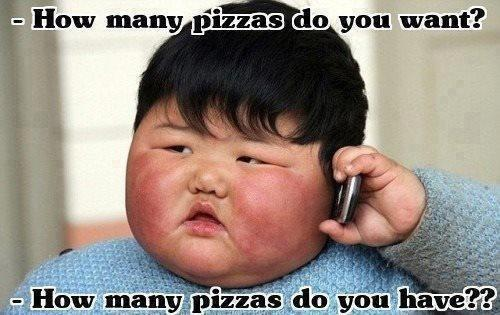

<p class="text-gray">
 🔗 이 글은 Varun Mohapatra가 <a href='https://uxdesign.cc/' target='blank' rel='nofollow' id='outlink1' onclick='clickedOutlink(outlink1)'>UX Collective</a>에 올린 <a href='https://abit.ly/article_45' target='blank' rel='nofollow' id='outlink2' onclick='clickedOutlink(outlink2)'>아티클</a>을 번역, 요약한 글입니다.
</p>

저자는 B2B 프로덕트와 기업용 애플리케이션을 동일하게 간주하여 말하고 있습니다. 저자는 B2B를 Enterprise로 표현하고 있지만 번역 후 해석의 용이성을 위해 이 글에서는 모두 B2B로 표현합니다.

2018년 1월 글이지만 제가 B2B, SaaS를 디자인하면서 공감이 되는 글이라 번역에 옮깁니다.

## ⚡️ 요약
**1. 기능적 복잡도 😓**
> B2B 프로덕트는 복잡합니다. 사용자도 B2B 프로덕트를 익혀 잘 사용하기까지 리소스를 투자해야 합니다. 이 말은 B2B 프로덕트의 기능 릴리즈는 아주 비싸다는 말입니다. 하나의 기능을 릴리즈하기 전에 충분히 디자인씽킹 하고, 모든 가능성을 점검한 후 인터페이스를 디자인해야 합니다.

**2. 근로자(실사용자) 마인드셋을 위해 디자인하기 💼**
> B2C 프로덕트와 가장 다른 점이라고 할 수 있습니다. B2B 프로덕트는 기업 사용자의 업무를 효율적으로 처리하기 위해 존재하므로 사용자의 사용 목적부터 다릅니다. 사용자의 도메인에 대해 자세하게 이해하고 그들의 워크플로우를 뜯어볼 수 있어야만 진정으로 사용자에게 유용한 B2B 프로덕트를 만들 수 있습니다.

**3. 높은 전환 비용을 인지하기 😟**
> B2B 프로덕트는 이미 존재하는 워크플로우를 빠르고/효율적이고/더 낫고/더 저렴한 방식으로 해결할 방법을 제안하는 것입니다. 따라서 경쟁 프로덕트가 있는 경우가 많은데, 한 프로덕트에서 다른 프로덕트로 옮겨가는 전환 비용이 B2B 프로덕트에서는 더 클 수밖에 없습니다. 높은 전환 비용이 있음에도 불구하고 우리 프로덕트를 사용할 수 있도록 데이터 마이그레이션 과정을 최적화 고, 사용법을 쉽게 익힐 수 있게 하고, 경쟁 프로덕트보다 더 저렴하면서도 더 효율적으로 일을 처리할 수 있는 프로덕트를 만들어야 합니다.

**4. 새로운 기능과 가능성을 만드는 것을 우선순위로 두기 😤**
> B2B 프로덕트는 사용자들의 끊임없는 요구사항을 프로덕트의 비전에 맞추어 달성 해나가야 합니다. 하지만 혁신적인 프로덕트는 사용자의 이야기를 실현하는 것만으로는 달성할 수 없습니다. 포드가 자동차를 처음으로 만들 때 사람들은 더 빠른 말만을 원하고 있던 것처럼요. B2B 디자이너는 사용자가 원하는 새로운 기능을 만드는 것과 혁신의 가능성을 만드는 두 측면을 항상 생각해야 합니다.

**5. UX 일관성을 유지하기 😊**
> 원 글은 2018년에 작성되었기 때문에 저자의 요점과 다른 점에서 풀어보도록 하겠습니다. B2B 프로덕트는 다양한 사용자가 각자의 워크플로우에 맞는 다양한 기능을 사용하기 때문에 한 프로덕트에서도 사용 케이스가 세세하게 분화되기 마련입니다. 한 사용자의 사용 케이스가 변화하더라도 일관된 UX를 제공해야 하는데, 프로덕트 팀이 커질수록 이를 지키기가 어려워집니다. 작게는 디스크립션 레이블 어미에서 크게는 특정 기능이 사용되는 방식까지 달라지는 것을 경험할 수 있습니다. 항상 내가 디자인 하는 기능이나 개선사항이 다양하게 사용될 수 있음을 인지하고 일관된 UX를 구현할 수 있도록 여러 업무 유관자와 커뮤니케이션 하는 것이 중요합니다.

**6. 모든 디자이너가 B2B 프로덕트를 좋아하진 않는다 😢**
> 많은 디자이너들의 호불호가 갈리는 지점은 B2B 프로덕트는 화려하고 심플한 UI로 사용자들을 사로잡는 게 아니라, 업무를 잘 도와줄 수 있도록 예측가능하고 명확한 디자인을 해야한다는 점입니다. B2B 디자인은 익숙하지 않은 도메인과 복잡한 프로덕트 구조 속에서 기업 사용자가 가지는 복잡한 문제를 해결해나가면서 빠르게 개인의 역량을 성장시킬 수 있습니다.

---


## Intro


내가 <a href='https://www.vwo.com/' target='blank' rel='nofollow' id='outlink3' onclick='clickedOutlink(outlink3)'>VWO</a>에서 일을 시작하면서 이런 의문을 느낄만 한 순간들이 많이 있었다. 기업용 애플리케이션(B2B)는 정말 일반 소비자용 앱(B2C)와 다른가? 다른 점이 있다면 디자이너와 디자인 프로세스에 어떤 영향을 미치는가?

지난 몇 년간 내가 경험한 점들을 B2B 팀에 입사하려고 하거나 이미 일하고 있는 사람들에게 공유한다.

## 기업용 애플리케이션이란 무엇인가?

위키피디아는 다음과 같이 정의하고 있다.

> An enterprise application is a computer software used to satisfy the needs of an organization rather than those of individual users.  
기업용 애플리케이션은 개인 사용자보다 조직의 니즈를 충족시키기 위한 컴퓨터 소프트웨어이다.


<figcaption>한 번쯤 봤을 기업용 프로덕트의 예시</figcaption>

오늘날의 기업 환경에서, 대부분의 B2B 프로덕트는 복잡하고, 확장성 있고, 분산되어있고, 컴포넌트 중심이고, 중요한 미션을 가지고 있다. 기업용 애플리케이션은 비즈니스 프로세스를 지원하거나 자동화하기 위해 복잡하고 많은 양의 데이터를 적재하고, 가공하고, 제공하는 데 의의가 있다.

기업용 툴은 조직과 그 구성원들이 더 잘 일할 수 있도록 하는 프로덕트를 만드는 것이다.

*메모: '기업용'과 'B2B' 용어 정의에서 약간의 차이가 있긴 하다. 하지만 오늘날의 소프트웨어 환경에서 이러한 차이점은 중요하지 않으며, 이 글의 목적에 따라 둘을 동일한 의미를 가집니다.*

<figcaption>(*역자 주: 아래부터는 기업용 애플리케이션을 모두 B2B 프로덕트로 칭하겠습니다)</figcaption>

## B2B 프로덕트 디자인은 B2C 프로덕트를 디자인하는 것과 어떻게 다를까?

B2B 프로덕트 디자인은 생각만큼 많이 다르지는 않다. 모든 좋은 디자인을 위한 원칙이 동일하게 적용된다. 하지만 B2C 프로덕트를 디자인하는 것과 B2B 프로덕트를 디자인 하는 것에 약간의 다름이 있다.

**시장에 내놓을 자동차를 만드는 것**과 **상업용 비행정을 만드는 것**을 생각해보자. 둘 다 A에서 B로 사람들을 이동시킬 고도의 엔지니어링 디자인이 접목되지만 사용 방법, 제조에 소요되는 시간, 테스팅 & 안전 기준, 사용자들의 기대, 구매 & 소유와 같이 디자인과 프로세스에 영향을 주는 모든것에 명확한 차이가 있다.

> 마찬가지로 B2B 앱의 경우 앱이 목표로 하는 고유한 문제와 그 접근 방식에 항상 차이가 있습니다.

## 직면하게 되는 문제:

*알림: 이런 문제 중 몇몇은 어떤 종류의 소프트웨어를 디자인하든 동일하게 직면하는 문제들도 있지만, B2B 프로덕트 디자인에서는 훨씬 차별적으로 나타납니다.*

## 1. 기능적 복잡도 😓

B2B 앱은 여러 데이터 상태, 시각화 옵션, 관리 작업, 여러 사용자의 협업, 다른 소프트웨어와 연동과 같이 셀 수 없는 요소가 있기 때문에 복잡도 규모는 보통 B2C 앱보다 더 크다. 하나의 요구사항을 만족시키기 위한 모든 디자인 의사결정이 다른 여러 요구사항에 영향을 미치고, 종종 어떤 임팩트가 있을지 예상하기까지 어렵다. 겉보기에 간단해 보이는 기능을 추가하는데 온갖 종류의 엣지 케이스를 확인해야 하는 과정을 거쳐야만 한다.


<figcaption>(2018년이라 현재 화면과 약간의 차이가 있습니다) 아틀라시안의 '지라'의 화면 : 복잡한 기능적 요구사항의 예시</figcaption>


### 💪 해결하는 방법:

복잡성을 해결하는 방법은 뭘까? — 답은 당연히 단순성이다. 인터페이스의 단순성을 최근(*2018년) 유행하는 미니멀 UI와 혼동하지 말라. 여기서 말하는 단순성은 적절한 계획과 프로세스를 통해 구현된 것을 말한다. 프로덕트 사이클이 얼마나 타이트하든 '디자인씽킹'하는 것과 디자인을 시작하기 전에 우리가 수집한 일련의 요구사항과 기능 명세들을 정리하는데 시간을 투자하는 것이 중요하다. 사실 이 과정은 디자인의 대부분이라고 할 수 있다.

당신이 떠올린 해결책이 확실하다고 생각할 때면 곧바로 스케치, 피그마, 포토샵을 켜고 싶은 것은 아주 자연스러운 경향이지만 실은 너무 이른 경우가 대부분이다. 전체적인 컨텍스트와 발견 점을 정리하고 내가 어떤 것을 디자인할지에 대해 정리할 수 있는 시간을 갖는것이 중요하다. 리서치와 계획하는 단계를 거치고, 모든 가능성을 발견하고 모든 엣지 케이스를 다뤄야 한다. 마침내 준비되었을 때 인터페이스를 다듬기 시작하자.


```
"나에게 만약 나무를 자를 6시간이 주어진다면, 나는 첫 4시간을 도끼를 날카롭게 가는데 쓰겠다."
— 격언
```


> 적절한 계획과 작업 과정을 거치게 되면 장기적으로 보상받을 것이며, 결국 논리적이고 버그 없는 프로덕트 경험을 이끌어낼 것이다.

## 1. 근로자(실사용자) 마인드셋을 위해 디자인하기 💼

B2B 프로덕트 사용자의 마인드셋과 행동 양식은 일상적인 B2C 사용자와 매우 다르다. 기업 사용자들은 일반적으로 그들의 일을 효율적으로 완료하는 것 이외에도 그들의 커리어 성장, 배움, 조직에서의 성공과 같은 다른 목표가 있다. 프로페셔널 근로자들을 위해 디자인 하는 것은 그들의 업무 컨텍스트, 워크플로우, 환경, 소명, 문제와 그들이 사용하고 있는 현재 솔루션에 대해 잘 이해하는 것이 필요하다.

### ✌️ 최고로 잘 할 수 있는 방법:

B2B 프로덕트는 프로덕트 자체에 대한 사용자의 니즈를 넘어 그들의 직업과 커리어에 대한 이해가 아주 중요하다. 최종 사용자와 직접 대화하고, 그들의 도메인을 조사하고 그들의 현재 방식을 체험해보는 것은 사용자에 대한 공감을 발전시키는 데 유용하다.

또한 사용자들은 종종 현재 워크플로우와 루틴에 익숙해져 있어서 그들이 진짜로 원하는 것이 무엇인지 상상하기 힘들어한다. 그들이 말하는 기능과 옵션들은 프로덕트 혁신으로 향하는 길을 밝혀줄 수 없는 것을 말하는 것일 수도 있다.



<figcaption>당신의 사용자들은 그냥 더 많은 것이 더 좋다고 생각할 수 있다</figcaption>

B2B 프로덕트 팀을 위한 가이드 원칙은 고객들이 현재 어떤 부분에서 난관을 겪고 있는지 알고, 이 이슈들을 해결하는데 미래에 프로덕트가 무엇을 해야 할지 길을 그리는 것이다. 사용자의 장기적인 목표를 알고 난 다음 디자이너들이 할 수 있는 일이 많아진다.

```
사람들은 더 나은 자신이 되기 위해 프로덕트를 구매한다 — JTBD (https://jtbd.info/)
(*Jobs To Be Done)
```

> 사용자들이 자신이 원하는 것이 뭔지 말하는 것에 집중하지 말고, 그들이 어떻게 행동하는지에 집중하고 그 포인트에서 혁신을 끌어내야 한다. 아이디어를 린하게 프로토타입으로 만들어 사용자에게 테스트 해야 한다.

## 3. 높은 전환 비용을 인지하기 😟

종종 기업 사용자들은 지금 가지고 있는 워크플로우에 너무 익숙하고 만족하고 있어서 다른 프로덕트로 변경해야 할 니즈를 전혀 느끼지 못하기도 한다. 심지어 다른 프로덕트로 변경하고자 할 때도, 여러 사람의 동의와 합의가 필요하기까지 한다. 당연히 현존하는 데이터를 마이그레이션 하는 것은 회사와 근로자 모두에게 불편사항이기도 하다. 일반적인 소비자 앱과는 달리, B2B 프로덕트를 변경하기 위한 전환 비용은 상당히 높다.

### 😳  관리하는 방법:

기업에게 프로덕트를 변경하라고 설득하는 방법에는 크게 2가지가 있다.

1. **경쟁 프로덕트보다 기능적으로 훨씬 더 나아야 한다**
2. **현재 워크플로우를 재정의해서 사용자에게 현재보다 훨씬 더 빠르고/낫고/효율적이고/매력적이게 한다**

두 번째 방법에서 디자인이 진가를 발휘할 수 있다. 생산성, 워크플로우, 프로세스는 조직에게 굉장히 중요한 요소이다. 그들의 현재 솔루션을 잘 살펴보고, 어느 부분에서 그들이 난관을 겪고 있는지 확인해보자. **더 빠른 워크플로우, 더 높은 효율성, 더 낮은 비용을 실현할 수 있는 요소를 찾아보자.** 이런 면들에서 혁신이 있다면 기업들이 점프하도록 설득할 수 있는 해결책으로 이어질 수 있다.

```
사람의 행동을 변화시키는 것만이 혁신을 측정하기 위한 가장 최고, 유일, 진정하고 직접적인 방법이다.
— Stewart Butterfield, Slack의 공동창업자
```

> 현재 접근방식을 더 효율적으로 바꿀 기회를 항상 찾아야 한다.

## 4. 새로운 기능과 가능성을 만드는 것을 우선순위로 두기 😤

B2B 프로덕트는 기존 사용자 경험을 강화하는 것 보다 새로운 기능을 만드는 것이 거의 모든 순간에서 우선한다. 프로덕트가 첫선을 보이는 시기엔 디자인 스프린트를 열성적으로 가져가는 것이 일반적이지만, 프로덕트가 출시된 후에는 기능을 계속해서 추가해야만 한다. 유료 고객들은 새로운 가능성과 추가 기능을 계속해서 요구할 것이다. 프로덕트 팀은 앞에 놓여있는 바쁜 로드맵을 미리 계획합니다. 이 시점에서는 디자이너가 업무 관계자들에게 UX와 디자인을 개선하는데 시간을 투자하자고 설득하는 것이 특히 더 힘들 수 있다.

### 😳 해결하는 방법:

주어진 상황을 업무 관계자들의 입장에서 그려보라. 그들은 어느 스프린트, 어느 주나 어느 월에서든 새로운 기능을 개발하거나 가능성을 추가하지 않는 것은 잠재적인 수익을 어느 정도 잃는 것과 같다고 생각한다. 따라서 사람들에게 UX나 디자인 개선이 가지는 힘이나, 개선했을 때 기능을 추가함으로써 가져올 수 있는 수익보다 더 큰 임팩트를 줄 수 있음을 이해시키는 게 중요하다. 성공 사례를 이야기하고, 상위 의사결정자에게 직접 이야기해서 그들의 마음을 이끌어내라. 개선사항을 디자인 하는 것은 항상 페인 포인트를 주의 깊게 분석하고, 아이디어를 실험해야 하므로 시간과 혁신이 필요할 것이다.

또, 현존하는 프로덕트를 개선하는 것은 성장하는 회사에 아주 중요하기 때문에 훈련 삼아 한 번씩 자신의 프로덕트나 경쟁 프로덕트가 없다고 생각하고 완전 처음부터 솔루션을 브레인스토밍 하는 것을 추천한다. 이렇게 한다면 즐거운 놀라움을 경험하게 될 것이다.

```
"전구는 촛불의 지속적인 개선에서 나온 것이 아니다."
— Oren Harari
```

회사를 설득한 다음엔 시간을 정한 스프린트에서 작은 성공을 경험하는 것으로 시작하고, 그 성공의 임팩트를 항상 측정하자. 회사가 디자인에 믿음을 서서히 가지도록 만들어서 점점 더 큰 개선과 실험으로 나아가라.

> 프로덕트 팀과 엔지니어링 팀이 좋은 UX를 구현할 수 있도록 헌신해달라고 부탁하고, 이게 디자인 팀만의 일이 아님을 알려주자.

## 5. UX 일관성을 유지하기 😊


<figcaption>출처: <a href='https://www.uxpin.com/enterprise-ux-design-2017-2018-industry-report' target='blank' rel='nofollow' id='outlink4' onclick='clickedOutlink(outlink4)'>
Enterprise UX Industry Report 2017–2018</a></figcaption>

최근(*2018년) 3,000개 이상 기업의 디자이너를 대상으로 한 설문조사에서 디자인 팀이 가장 직면하고 있는 가장 큰 문제는 UX 일관성이었다. 일반적인 소비자용 프로덕트와 다르게, B2B 프로덕트는 더 긴 프로덕트 사이클을 가지고 있고 여러 팀으로 나누어져서 병렬적으로 실행되는 경우가 많다.

모든 디자이너들은 다른 팀들과 똑같이 프로덕트의 컴포넌트, 디자인 패턴, 심지어 컬러와 같은 디테일을 변경할 때 일관성을 유지하지 못하는 문제에 직면하고 있다. 이런 문제점은 팀 사이즈가 크거나 프로덕트가 확장하게 될 때 곱절이 되어버린다.

### 💪 해결하는 방법:

많은 회사가 장기적인 일관성과 확장성을 위해 **디자인 시스템**을 만들게 된다. 디자인 시스템은 명확한 기준으로 가이드 된 재사용 가능한 컴포넌트의 집합이고, 조합을 통해 여러 종류의 애플리케이션을 만들 수 있다. 디자인 시스템은 보통 다음을 포함한다:

1. **가이드라인** (디자인 원칙, 코드 컨벤션, 편집 가이드라인 등)
2. **비주얼 애셋** (컬러 팔레트, 타이포그래피 스케일, 아이콘 등)
3. **UI 패턴** (폼, 버튼 스타일, 페이지 패턴 등)
4. **사용과 유지보수**를 위한 포인트들

B2B 프로덕트 팀들에게 디자인 시스템이 있는지 물어보았을 때, 55% 정도는 가지고 있거나 만들고 있는 중이라고 답변했다(*2018년 기준!). 이것은 긍정적인 신호이다. 한 가지 알아두어야 할 점은 디자인 시스템을 100% 끝내는 순간은 없다는 것이다. 장기적으로 만들어나가야 하는 것이고, 시간이 지나면서 진화해 나가는 것이다.

```
"각 요소의 디자인은 제작하기 쉬워야 하고, 고치기도 쉬워야 한다."
— Leo Fender
```

> **디자인 시스템은 일관성 있는 UX를 만들기 위한 큰 발걸음이다.**
> <br><br>
> 영감을 얻을 수 있는 B2B 프로덕트 디자인 시스템의 예시: Salesforce의 <a href='https://www.lightningdesignsystem.com/' target='blank' rel='nofollow' id='outlink5' onclick='clickedOutlink(outlink5)'>Lightning Design System</a>, Intuit의 <a href='https://designsystem.quickbooks.com/' target='blank' rel='nofollow' id='outlink6' onclick='clickedOutlink(outlink6)'>Quickbooks</a>(구 Harmony Design System)

<p class="text-gray">*역자 주. 역자가 추천하는 공개된 디자인 시스템의 예시도 추가합니다:</p>  
> Segment의 <a href='https://evergreen.segment.com' target='blank' rel='nofollow' id='outlink7' onclick='clickedOutlink(outlink7)'>Evergreen</a>, Atlassian의 <a href='https://atlassian.design/foundations/accessibility' target='blank' rel='nofollow' id='outlink8' onclick='clickedOutlink(outlink8)'>Design System</a>, Elastic Search의 <a href='https://elastic.github.io/eui/#/' target='blank' rel='nofollow' id='outlink9' onclick='clickedOutlink(outlink9)'>Elastic UI</a>, IBM의 <a href='https://www.ibm.com/design/language/' target='blank' rel='nofollow' id='outlink10' onclick='clickedOutlink(outlink10)'>Design Language</a>, Google의 <a href='https://material.io/' target='blank' rel='nofollow' id='outlink11' onclick='clickedOutlink(outlink11)'>Material Design</a>, SendGrid의 <a href='http://styleguide.sendgrid.com/index.html' target='blank' rel='nofollow' id='outlink12' onclick='clickedOutlink(outlink12)'>StyleGuide</a>, Zendesk의 <a href='https://garden.zendesk.com' target='blank' rel='nofollow' id='outlink13' onclick='clickedOutlink(outlink13)'>Garden</a>, Microsoft의 <a href='https://www.microsoft.com/design/fluent/#/' target='blank' rel='nofollow' id='outlink14' onclick='clickedOutlink(outlink14)'>Fluent</a>, Mixpanel의 <a href='https://design.mixpanel.com/' target='blank' rel='nofollow' id='outlink15' onclick='clickedOutlink(outlink15)'>Design System</a>

## 6. 모든 디자이너가 B2B 프로덕트를 좋아하진 않는다 😢

B2B 프로덕트를 위해 일해본 디자이너 중 이 일이 지루하다고 생각하는 사람이 많다. 에이전시나 B2C 백그라운드를 가진 사람들은 B2B에서 일하는 것이 다양성이 부족하고 흥분되지 않는다고 생각하기도 한다. 우리가 dribbble에서 침 흘리며 보는 멋진 마이크로 인터랙션 비주얼과 애니메이션을 만들 기회는 잘 오지 않는다. 이런 경우 업무는 늘어지게 되고 디자이너들은 뭔가가 빠진 것처럼 동기부여가 되지 않게 된다

### 😳 방지하는 방법:

B2B 프로덕트 디자인은 고객들의 과업을 해결해주어 그들이 직장에서 더 나은 삶을 살 수 있도록 돕는 데 있다. (위험하지만 않다면) 사용자를 홀릴 수 있는 UI를 만드는 것은 언제나 우선순위 리스트 중 가장 하단에 있을 것이다. **보는 즉시 직관적으로 어떻게 작동할지 알 수 있는 표준화되고, 예측 가능한 사용자 인터페이스가 타겟 고객들에게 가장 좋은 UI이다.**

> 우리의 목표는 사용자들에게서 **"와우!"** 를 받는것이지만 — 프로덕트가 그들의 일을 얼마나 효율적으로 돕는지로부터 와야 하지, 아름다운 UI로부터 와야 하는것이 아니다

B2B 디자인 팀을 구성할 때 목표와 동기가 일치하는 디자이너를 선택하는 것은 중요하다. 동기라 함은 복잡한 문제를 풀고, 자신의 디자인이 사용자의 일을 완료하는데 어떻게 도움이 되는지 보는 것에서 와야 한다.

> ***따라서, 팀에 들어올 모든 디자이너들에게 이후 일어날 일들을 예상하게 하고 올바른 기대치를 설정하는 것이 중요하다.***

---

## B2B 디자인에 입문할 때 필요한 일반적인 조언 몇 가지

**B2B는 진화하고 있다.** B2B 프로덕트는 더이상 삐걱거리고 지겨운 것이 아니다. 오늘날 사용자들은 일반적인 B2C 앱에서 경험한 퍼포먼스와 경험을 원한다. 그들은 아름다운 UI를 즐기며, 첫 시작 전에 문서를 읽어야만 하는 것을 싫어한다. 차세대 기술인 VR, AI와 음성 인터페이스는 이미 우리의 일상 생활에 들어왔으며, 얼마 지나지 않아 우리의 업무 생활에도 들어올 것이다. B2B 프로덕트에게는 흥분되는 시기이며 디자이너들이 할 수 있는 일은 끝없이 있다.

당신에게 도움이 될 3가지 가이드:

1. **유연함과 모듈화를 받아들여라.** 디자인할 모든 것이 진화하고 성장할 것으로 생각해야 한다. 현재의 니즈에 딱 알맞은 컴포넌트를 만들려고 하지 말고 미래의 니즈도 반영할 수 있도록 유연하고 확장성 있게 만드는데 중점을 두어야한다.
2. **규칙과 프로세스를 정립하라.** 훌륭한 협업, 탄탄한 사용자 리서치, 액션 가능한 문제 정의, 집중된 디자인 이터레이션들은 한 번씩 달성할 순 있지만 매번 모든 것을 달성하기란 어려운 일이다. 효율적인 방법은 반복 가능한 프로세스를 만들고 매 사이클마다 조금씩 개선해나가는 것이다.
3. **전체를 생각하라.** 당신의 디자인과 추가되는 기능들이 프로덕트 전반과 회사의 비전에 어떤 영향을 주는지에 대해 항상 인지하고 있어야 한다. 당신이 만들고, 추가하고, 개선하는 모든 것에 전체적인 관점으로 접근한다면 결국 논리적이고 일관된 프로덕트 경험으로 이어지게 될 것이다.

---

### B2B 디자이너들의 모임 소개   
B2B 프로덕트를 만들고있는 B2B 디자이너들은 B2C 디자이너보다 더 어려운 문제를 풀고 있는 경우가 많은데 비해 자료, 지식, 피드백을 찾는데도 어려움을 겪고 있습니다.

더 많은 B2B 프로덕트 디자이너들이 한 자리에서 어려운 점, 배운 점을 공유하고 서로 도움이 되기 위해 커뮤니티를 운영중입니다.

[🔗 B2B 디자이너들의 모임 노션 바로가기](https://abit.ly/b2b-designers)